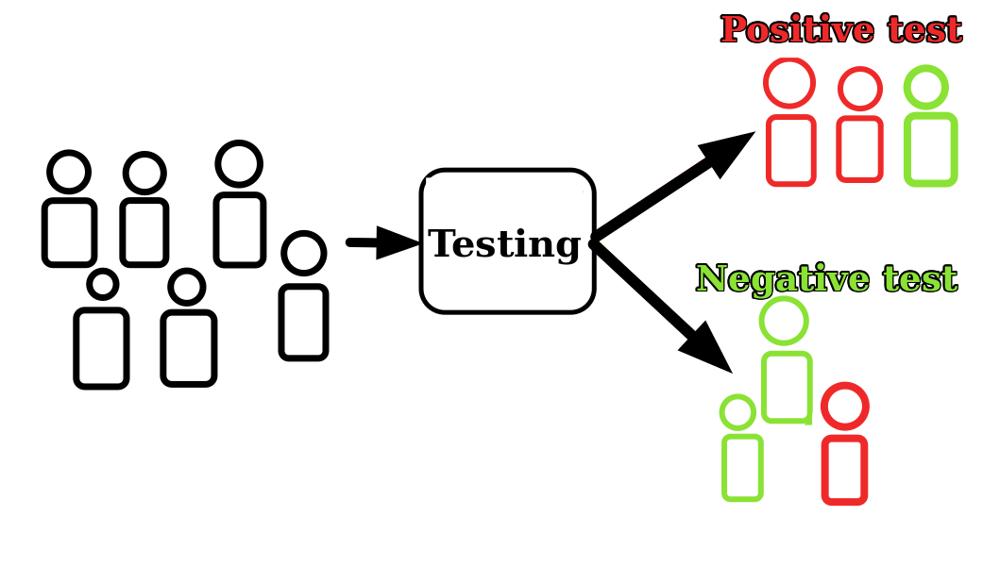

# Brief

In this post I will introduce funadmentals for classsification. I will discuss testing and associated errors: true negative, true positive, false negative, and false positive. Additionally, we will look at how these can be neatly summarized in confusion matrix

## Setup
Most of us witnessed COVID-19 pandemic and had a chance to undergo a COVID-19 test. One question that might arise is how good were these tests? 

To start of imagine a population of people. Then we can sort them into two groups: those that have covid (positive), and those that do not have covid (negative) (see Figure 1). I will call this: sorting by disease status.
{: width="972" height="589" }
_Figure 1: dividing population by disease status._

## Testing

However, once the testing is introduce, there is a chance of miscategorizing people (see Figure 2). In general, miscategorization can occur in two ways. Either a person has covid and testing concludes that he does not. We call this case false negative.

Alternativelly, a person does not have covid, but the testing concludes that he does. We call this case false positive. 

{: width="972" height="589" }
_Figure 2: testing population and categorizing as positve, or negative test resutlt._

Therefore, instead of two categories, as in sorting by disease status we end up with four: true positive, true negative, false positive, false negative. True, or false indicates whether disease status matches the test result. Meanwhile positve, or negative indicates test result **NOT** disease status.

If testing categorizes person correctly he is true positive, or true negative based on his disease status. However, if miscategorization occurs the person is labeled as false positive, or false negative according to his test result. 

These four cases can be neatly summarized in **confusion matrix** (see Figure 3).

{: width="972" height="589" }
_Figure 3: summarizing results of the test. Positive, or negative is the result of the test. False, true indicates whether test result aligns with disease status._

## Implementation of confusion matrix
To obtain entries of the confusion matrix in Python we can use the following commands: 
```python
#adds required command from sklearn library
from sklearn.metrics import confusion_matrix

#tn corresponds to True Negative, fp to False Positive, etc.
# disease_status, and test_results are dataframes
tn, fp, fn, tp = confusion_matrix(disease_status, test_results).ravel()
```

## Conclusion
In this post, I introduce testing. In particular, the post discussed how testing introduces four categories, rather than two of having disease or not having the disease. Additionally, confusion matrix was introduced to summarize testing categories: true negative, false positive, false negative, true positive. In the next post, on categorization we will look at the metrics that arrise from confusion matrix.
